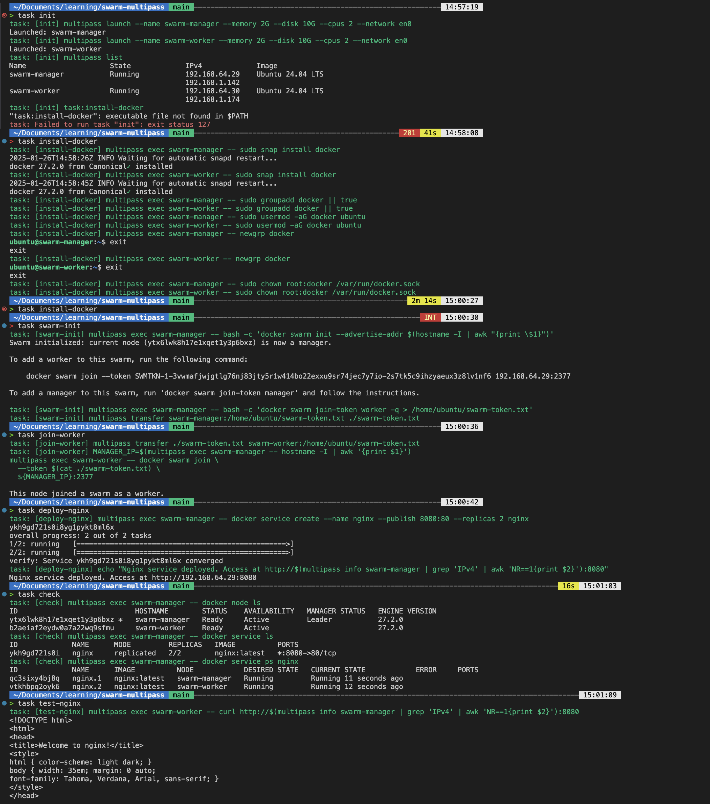

# Docker Swarm via multipass

This demo showcases the setup of a Docker Swarm cluster using Multipass and Taskfile, making it easy to spin up, manage, and deploy services on a Swarm cluster.

## Prerequisites

- Multipass – for managing lightweight Ubuntu VMs
- Taskfile – for task automation
- Docker (installed inside the VMs)

## Automated Setup (via Task)



- `task init` - Launches swarm-manager and swarm-worker VMs. Installs Docker and sets up permissions.
- `task swarm-init` - Initialises Docker Swarm on the manager node.
- `task join-worker` - Joins the worker node to the Swarm cluster.
- `task deploy-nginx` - Deploys an Nginx service with 2 replicas and exposes it on port 8080.
- `task check` - Lists the Swarm nodes and running services.
- `task test-nginx` - Tests if the Nginx service is accessible.
- `task all` - Test everything e2e
- `task cleanup` - Deletes all VMs and cleans up resources.

## Manual Setup

```bash

multipass networks

multipass launch --name swarm-manager --mem 2G --disk 10G --cpus 2 --network en0
multipass launch --name swarm-worker --mem 2G --disk 10G --cpus 2 --network en0

multipass list

multipass shell swarm-manager
multipass shell swarm-worker


## on both nodes
sudo snap install docker
## so we can use docker without sudo (on both nodes)
sudo groupadd docker
sudo usermod -aG docker ubuntu
newgrp docker
sudo chown root:docker /var/run/docker.sock


# on manager
docker swarm init --advertise-addr $(hostname -I | awk '{print $1}')

# on worker
docker swarm join --token SWMTKN-1-1qviivdzd0rhm3nlwd1mul52lip6ic809lathsj14e5bdm3vlq-abs235dcy4h3dv7e9bssqwhco 192.168.64.19:2377 

# manager

docker node ls

docker service create --name nginx \
  --publish 8080:80 \
  --replicas 2 \
  nginx

docker service ls

docker service ps nginx

curl http://192.168.64.21:8080
```

## Access

```bash
multipass info swarm-manager | grep IPv4

http://<manager-ip>:8080
```

## Using stack

```bash
docker stack deploy -c stack.yml app
```